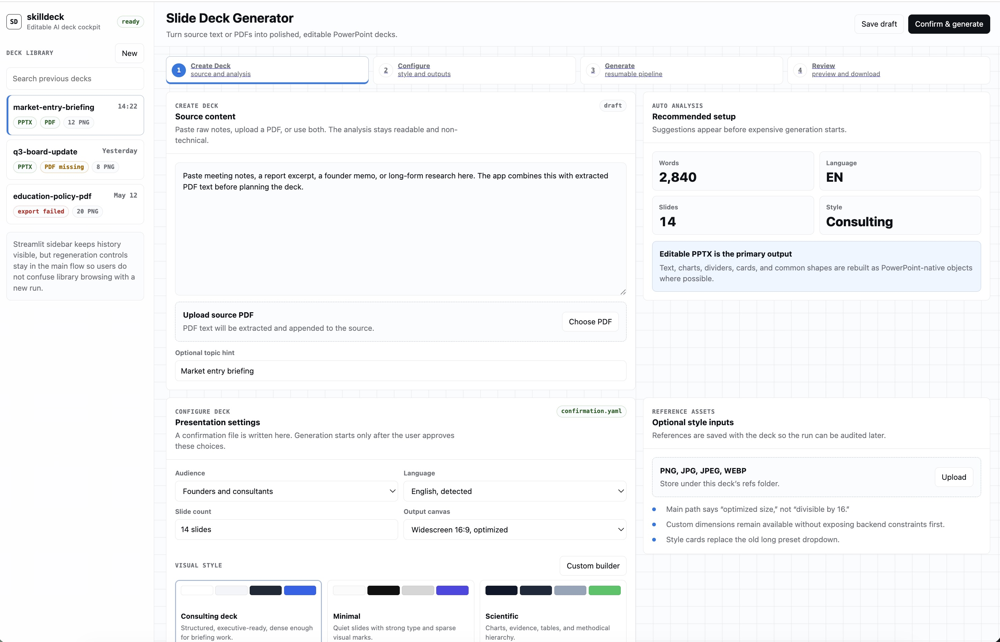

# skilldeck

Text or PDF → AI-generated slide images → **fully editable PowerPoint**, with native shape reconstruction, font matching, and layout snap.

A Streamlit front-end orchestrates a multi-stage pipeline:

```
source text / PDF
    └─► outline (LLM)                       ──►  outline.md
            └─► per-slide prompts (LLM)     ──►  prompts/NN-slide-*.md (+ optional .spec.json)
                    └─► slide PNGs (image API)
                            └─► editable PPTX (MinerU + VLM + python-pptx)
                                    └─► flat PDF (optional)
```



The slide-design half (outline + image prompts) was originally driven by the [`baoyu-slide-deck`](https://github.com/JimLiu/baoyu-skills/blob/main/skills/baoyu-slide-deck/SKILL.md) skill from JimLiu/baoyu-skills, vendored locally and renamed to `skill/`. The export half (`editable_pptx/`, `svg_to_pptx/`, `svg_finalize/`, `deck_assembler/`) is local. Narrative slides take the PNG → MinerU → editable PPTX path; chart slides take an SVG-template path; both kinds combine into one editable `.pptx`.

---

## What's in the box

| Path | Purpose |
|---|---|
| `streamlit_app.py` | Single-page Streamlit UI: text/PDF in → confirmation → outline → prompts → images/charts → PPTX/PDF |
| `editable_pptx/` | Image/PDF → editable PPTX pipeline (MinerU layout + VLM style + shape detection + python-pptx) |
| `svg_to_pptx/` | SVG → native DrawingML PPTX exporter (ported from `ppt-master`) |
| `svg_finalize/` | SVG post-processing — icon embedding, image cropping, tspan flattening, rect→path |
| `deck_assembler/` | Mixed-pipeline merge: image-slide PPTXs + chart-slide PPTXs → single deck |
| `skill/` | The skill folder: `SKILL.md`, `references/`, `scripts/`, `templates/` (charts, layouts, icons) |
| `notebooklm_style_agent/` | LangChain agent for style extraction from reference images (experimental, not wired into the default flow) |
| `slide-deck/` | Per-deck output folders: `<slug>/01-slide-*.png` or `*.svg`, `outline.md`, `prompts/`, `<slug>.pptx`, `<slug>.pdf` |

---

## Editable export pipeline (the interesting part)

The `editable_pptx` module reconstructs slide PNGs as native PowerPoint, in the spirit of Codia AI NoteSlide / `ppt-master`:

1. **MinerU** parses each slide PNG into typed regions (title, body, list, table, image).
2. **VLM (OpenAI-compatible chat-completions w/ vision)** infers per-region style — bold/italic/underline, alignment, text color, **`font_family_hint`**, **`weight`**, plus the page background color.
3. **VLM shape detection** enumerates decorative shapes the typed-region pass missed — rounded cards, pills, dividers, arrows, chevrons — with fill, stroke, corner radius, and z-order.
4. **Layout snap** rounds bboxes to a pixel grid then clusters shared edges/centers so columns line up.
5. **python-pptx assembly** emits:
   - native `MSO_SHAPE.ROUNDED_RECTANGLE`, `OVAL`, `CHEVRON`, `RIGHT_ARROW`, …
   - text boxes with **shrink-to-fit** sizing (PIL-measured against the chosen family — fixes CJK/Latin overflow)
   - either the original PNG as a masked background **or** a flat fill from the inferred page bg (`EDITABLE_PPTX_BG_FLATTEN=1`)
6. **Optional crosscheck** — render the produced PPTX back to PNGs via LibreOffice and ask the VLM to score each slide vs the source, writing `crosscheck_report.json`.

See [`skill/references/editable-pptx.md`](skill/references/editable-pptx.md) for the full env-var reference.

---

## Setup

```bash
git clone <this-repo> skilldeck && cd skilldeck
python -m venv .venv && source .venv/bin/activate
pip install -r requirements.txt
cp .env.example .env   # fill in keys (see below)
```

External tools:

- **LibreOffice** (only if using `EDITABLE_PPTX_CROSSCHECK=1`) — `brew install --cask libreoffice`. Autodetected at `/Applications/LibreOffice.app/Contents/MacOS/soffice`.
- **MinerU** API token — https://mineru.net (free tier works).
- An **OpenAI-compatible chat endpoint** for planning + an image-generation endpoint. Anthropic/OpenAI/local LM Studio all work via standard `/v1/chat/completions`.

---

## Configuration

All keys are read from `.env`. The minimum to run end-to-end:

```bash
# Planning LLM (outline + prompts)
PLANNING_BASE_URL=https://api.anthropic.com    # or OpenAI / your gateway
PLANNING_API_KEY=sk-...
PLANNING_MODEL=claude-opus-4-7

# Image generation
IMAGE_BASE_URL=https://your-host
IMAGE_API_KEY=...
IMAGE_MODEL=gpt-image-2

# Editable export
MINERU_TOKEN=...
EDITABLE_PPTX_STYLE_MODEL=gpt-4o          # multimodal model for style + shape detection
# EDITABLE_PPTX_BASE_URL / EDITABLE_PPTX_API_KEY default to PLANNING_*
```

Reconstruction-quality flags (all optional, sensible defaults):

| Var | Default | What it does |
|---|---|---|
| `EDITABLE_PPTX_SHAPE_DETECT` | `1` | VLM enumerates decorative shapes → native DrawingML |
| `EDITABLE_PPTX_LAYOUT_SNAP` | `1` | Pixel-grid snap + edge/center clustering |
| `EDITABLE_PPTX_SNAP_GRID_PX` | `8` | Snap grid size |
| `EDITABLE_PPTX_BG_FLATTEN` | `0` | Drop the bitmap background, paint a flat fill from the inferred page color |
| `EDITABLE_PPTX_CROSSCHECK` | `0` | Render output → score vs source via VLM, write `crosscheck_report.json` |
| `EDITABLE_PPTX_FONT_NAME` / `EDITABLE_PPTX_TITLE_FONT_NAME` | — | Override the font-hint table |

See `.env.example` for the full list.

---

## Usage

### Streamlit UI

```bash
streamlit run streamlit_app.py
```

Paste text or upload a PDF, pick a style preset, confirm, generate. The UI calls the same scripts you can run by hand.

### CLI: editable export only

If you already have a folder of slide PNGs (`01-slide-*.png`, `02-slide-*.png`, …), run the export directly:

```bash
python -m editable_pptx slide-deck/<topic-slug>
# → slide-deck/<topic-slug>/<topic-slug>.pptx
```

### Optional `<DESIGN_SPEC>` block

When the planning LLM emits this block in a slide entry, `streamlit_app.write_prompt_files` writes a sidecar `prompts/NN-slide-*.spec.json`. The export reads it and passes layout + shape hints to the VLM, making shape recovery much more reliable:

```markdown
<DESIGN_SPEC>
{
  "layout": "kpi_grid_3",
  "blocks": [
    {"role": "title", "text": "Q3 results"},
    {"role": "kpi", "text": "ARR $24M"},
    {"role": "kpi", "text": "NRR 132%"},
    {"role": "kpi", "text": "Logos +47"}
  ],
  "accent_color": "#3366cc",
  "shape_hints": [{"kind": "card"}, {"kind": "divider"}]
}
</DESIGN_SPEC>
```

Documented in `skill/references/outline-template.md`.

---

## Credits

- Outline + image-prompt half: vendored from [JimLiu/baoyu-skills · skills/baoyu-slide-deck](https://github.com/JimLiu/baoyu-skills/blob/main/skills/baoyu-slide-deck/SKILL.md), renamed to `skill/`. Layout gallery, style dimensions, content rules, and the planning prompts are all from upstream.
- SVG-chart half (`svg_to_pptx/`, `svg_finalize/`, `skill/templates/charts/`, `skill/templates/layouts/`, `skill/templates/icons/`) ported from the open-source `ppt-master` project.
- Editable PPTX, shape reconstruction, font matching, layout snap, crosscheck, and the mixed-deck assembler (`deck_assembler/`) are local to this repo.
- Inspired by **Codia AI NoteSlide** and the open-source `ppt-master` workflow — both convert slide bitmaps back into editable presentations rather than flattening them.

---

## License

See upstream [`baoyu-skills`](https://github.com/JimLiu/baoyu-skills) for the vendored skill's license, and upstream `ppt-master` for the SVG/charting half. Local code under `editable_pptx/`, `deck_assembler/`, `streamlit_app.py`, and `notebooklm_style_agent/` carries the repo's own license.
